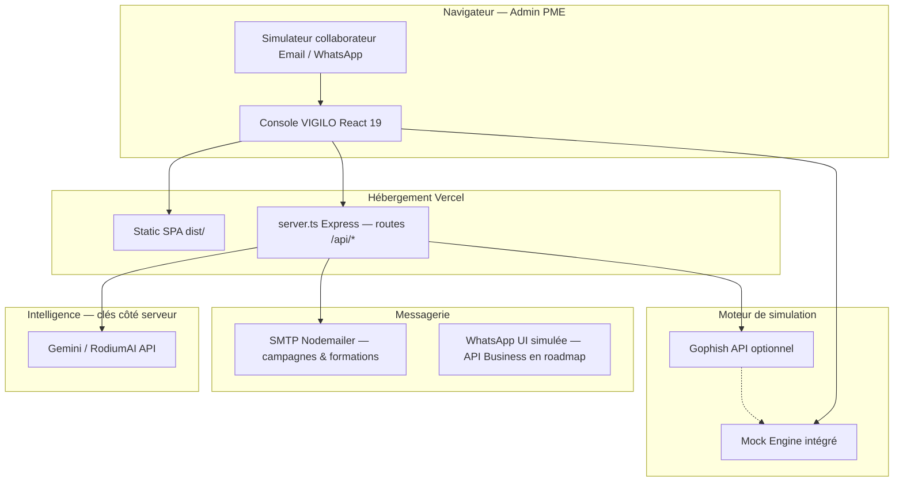

# VIGILO — Architecture & technique (pitch jury)

> Texte prêt à adapter à l’oral (2–3 min) + schéma + réponses Q&A technique.

---

## 1. Message clé (30 secondes)

« VIGILO est une **application web SaaS** : une **console React** pour l’admin PME, un **serveur Node** qui protège les clés IA et envoie les emails de test, et des **connecteurs** vers Gophish ou un **moteur mock** pour la démo. L’humain reste au centre : simulation → mesure → **RodiumAI** → micro-formation → re-test. »

---

## 2. Schéma logique (à projeter ou dessiner)



---

## 3. Couches détaillées (alignées sur le code actuel)

### 3.1 Frontend — Console & expérience collaborateur

| Élément | Techno | Rôle |
|---------|--------|------|
| UI admin | **React 19 + TypeScript + Vite** | Dashboard, campagnes, annuaire, formations, paramètres |
| Design | **Tailwind CSS v4**, tokens clair/sombre | UX type SaaS B2B, mobile (menu latéral) |
| Simulateur | Composants dédiés (`EmployeeSimulatorModal`, `WhatsAppSimulator`) | Parcours collaborateur sans envoi réel obligatoire |
| État prototype | React state + `mockData` | Hackathon / démo ; **prod** → API + base de données |

**Pour le jury :** « L’admin ne touche pas à Gophish à la main : tout passe par la console. Le collaborateur voit une inbox ou WhatsApp **réaliste**, avec signalement et micro-formation immédiate. »

### 3.2 Backend — Proxy sécurisé & APIs

| Route (exemples) | Fonction |
|------------------|----------|
| `POST /api/vigilo-ai/generate-scenario` | Génération scénario (RodiumAI / Gemini) |
| `POST /api/vigilo-ai/analyze-results` | Analyse campagne (Coach IA) |
| `POST /api/vigilo-ai/generate-training` | Micro-module pédagogique |
| `POST /api/send-live-test` | Envoi email simulation (SMTP) |
| `POST /api/send-training-invite` | Lien formation vers l’annuaire |
| `GET /api/health` | Santé du service |

**Fichier :** `server.ts` (Express) — déployé en **serverless Node** sur Vercel (`vercel.json` : rewrite `/api/*` → `server.ts`).

**Sécurité pitch :** « Les clés `GEMINI_API_KEY` et `RODIUM_API_KEY` restent **uniquement sur le serveur**. Le navigateur ne voit jamais de secret. »

### 3.3 Moteur de simulation (choix PME)

| Mode | Usage |
|------|--------|
| **Mock** (défaut) | Démo, hackathon, pilotes sans infra — stats et parcours collaborateur simulés |
| **Gophish** | PME matures : envoi SMTP réel, tracking, intégration RSSI existante |

Configurable dans **Paramètres** (`SimulationProviderSettings`).

### 3.4 IA — Vigilo Coach (RodiumAI)

- Entrées : type de scénario, public, difficulté, contexte PME (secteur Togo/UEMOA).
- Sorties : email/HTML, leviers psychologiques, red flags, conseils formation.
- **Fallback** : scénarios et analyses embarqués si API indisponible (démo offline jury).

### 3.5 Données & conformité (cible produit)

| Aujourd’hui (prototype) | Production visée |
|-------------------------|------------------|
| Données en mémoire navigateur | **PostgreSQL** (Neon / hébergeur UE ou Afrique) |
| Annuaire CSV / UI | Sync AD / Google Workspace (roadmap) |
| Stats agrégées | Pas de stigmatisation individuelle — **RGPD / loi Togo 2019-014** |

---

## 4. Déploiement

```text
GitHub → Vercel
  ├── build: vite build → dist/ (SPA)
  └── server.ts → fonctions Node (/api/*)
Variables d'environnement : GEMINI_API_KEY, RODIUM_API_KEY, SMTP_*
```

**Coût infra early-stage :** faible (tier Vercel + appels IA à la consommation) → compatible **prix forfaitaires** 12k–75k FCFA/mois.

---

## 5. Script oral architecture (≈ 2 min)

> « Architecturalement, VIGILO sépare trois responsabilités.
>
> **Premièrement**, la **console web** en React : c’est là que la PME crée une campagne, consulte les KPI, envoie une micro-formation à l’annuaire, et lance le re-test. Nous avons aussi un **simulateur WhatsApp et email** intégré pour montrer exactement ce que vit le collaborateur.
>
> **Deuxièmement**, un **backend Node/Express** hébergé sur Vercel. Il fait office de **proxy de confiance** : toutes les requêtes vers RodiumAI ou Gemini passent par lui, avec les clés API **côté serveur uniquement**. Il gère aussi l’envoi d’emails réels via SMTP quand la PME active cette option.
>
> **Troisièmement**, le **moteur de simulation** : en phase pilote nous utilisons un **Mock Engine** complet pour Lomé sans dépendre d’un datacenter ; pour la production, la même console se branche sur **Gophish**, standard open source des équipes cyber.
>
> La boucle métier est automatisée : campagne → métriques → analyse IA → formation 2 minutes → re-test. C’est cette boucle qui justifie notre modèle SaaS, pas un simple outil de phishing. »

---

## 6. Q&A jury — réponses courtes

**« Où sont stockées les données ? »**  
Prototype : session navigateur. Production : base managée chiffrée, hébergement contractuel UE/Afrique selon client ; stats de campagne **agrégées** par défaut.

**« WhatsApp, c’est réel ? »**  
Aujourd’hui : **simulation UI fidèle** + parcours pédagogique. Roadmap : **WhatsApp Business API / Twilio** pour envoi contrôlé avec charte RH.

**« Dépendance à Google ? »**  
Couche IA ** interchangeable** (RodiumAI / Gemini) ; scénarios de secours intégrés si API down.

**« Scalabilité ? »**  
Frontend statique CDN ; API stateless serverless ; goulots = SMTP et quotas IA — levés par files d’attente et cache de scénarios.

**« Intégration PME togolaise sans IT ? »**  
Mock + import annuaire CSV + pilote 30 jours ; le cabinet comptable ou MSP active le tenant.

---

## 7. Lien avec le business model

Architecture **légère** → coûts variables contenus → **forfaits 12k–75k FCFA/mois** viables.  
Une ETI de 51 personnes paie **55 000 FCFA/mois**, pas un calcul « 15 000 × 51 ».

Voir `BUSINESS_MODEL_AFRIQUE_TOGO.md` § 5.2.
